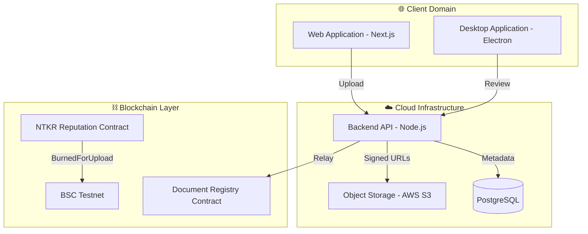
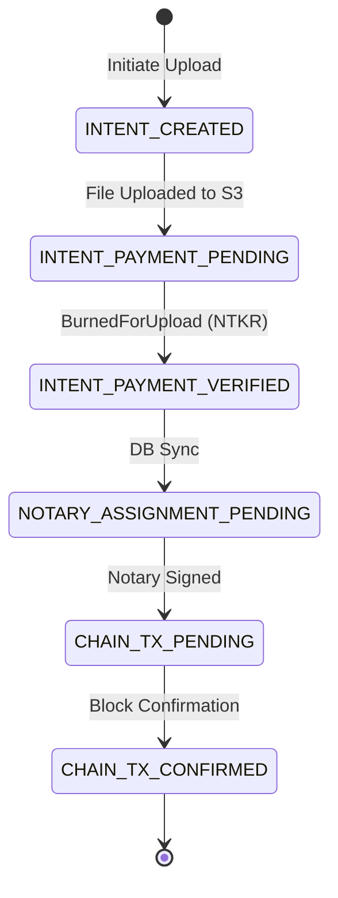
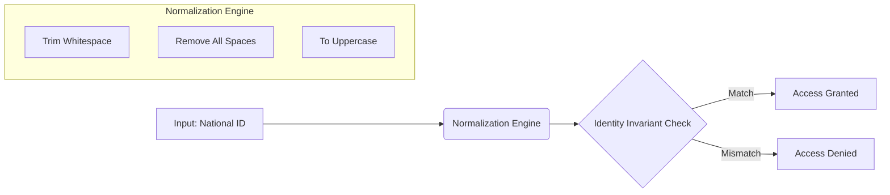

# 🛡️ BBSNS: The Global Secure Notarization Protocol

**BBSNS (Block-Chain Based Secure Notarization System)** is a decentralized infrastructure designed to provide absolute cryptographic certainty for document authenticity. By combining local desktop security with global blockchain finality, BBSNS eliminates the risk of document tampering and centralized identity fraud.

---

## 🏛️ 1. High-Level System Architecture

BBSNS operates across three distinct domains to ensure maximum security and scalability.

### **The Technical Reality:**
- **NTKR Integration**: The system utilizes the **NTKR (Reputation Token)** contract for upload commitments. Users must trigger a `BurnedForUpload` event before the document enters the notary queue.
- **AWS S3 Lock**: Storage is strictly managed via AWS S3 with **Signed URL** generation for secure, temporary document access.
- **Stateless Orchestration**: The Backend API manages the bridge between cryptographic identity and permanent file storage.

---

## 📂 2. The Document Lifecycle (UX State Contract)

BBSNS uses a **State Perception Model** to track documents from intent to on-chain finality.

### **Authoritative States:**
- **INTENT_PAYMENT_PENDING**: The file is safe in S3, waiting for the blockchain commitment.
- **NOTARY_ASSIGNMENT_PENDING**: The document is visible in the Public Notary Pool for claiming.
- **CHAIN_TX_CONFIRMED**: The document hash and notary signature are permanently etched into the BSC Testnet.

---

## 🔐 3. Forensic Identity & Invariants

BBSNS implements a **Zero-Trust Identity Invariant** system that normalizes sensitive identifiers to prevent collision attacks.

### **Security Invariants:**
- **ID Normalization**: National IDs are processed through a `replace(/\s+/g, '').toUpperCase()` pipeline before hashing.
- **Identity State Gate**: Only users with `identity_state === 'ACTIVE'` can bypass the `requirePrivilege` middleware. **REJECTED** or **DEACTIVATED** states result in an immediate forensic lockout.

---

## 🖋️ 4. EIP-712 Remote Signing Bridge

The system utilizes **EIP-712 Typed Data Signing** to ensure that Notaries can verify the exact contents of the payload (Doc Hash, Owner Address, Status) before signing.

### **The Handshake Protocol:**
1. **Desktop App**: Requests an atomic signature payload from the Backend.
2. **Remote Auth Bridge**: Renders the document preview via a signed S3 URL.
3. **Wallet Signing**: The Notary signs the EIP-712 message.
4. **Relay**: The Backend submits the signature to the `recordAction` function on the `DocumentRegistry` contract.

---

## 🏛️ 5. Governance & Resilience

- **Multi-Sig Control**: Protocol updates are managed via a threshold-based governance model in the `NotaryRegistry` contract.
- **Self-Healing Workers**: 
    - **Reconciliation**: Heals the "Sync Gap" for documents confirmed on-chain but pending in the DB.
    - **Scavenger**: Purges orphaned S3 intents to maintain storage hygiene.
- **Circuit Breaker**: The `requireUnpaused` middleware can freeze all mutations during protocol upgrades.

---

## 📜 Verified Stack
- **Node.js v18+** (Backend API)
- **Solidity 0.8.20** (Smart Contracts)
- **PostgreSQL 14+** (State Management)
- **AWS S3 / KMS** (Storage & Encryption)

---

**BBSNS: Authenticity through Cryptographic Finality.**
