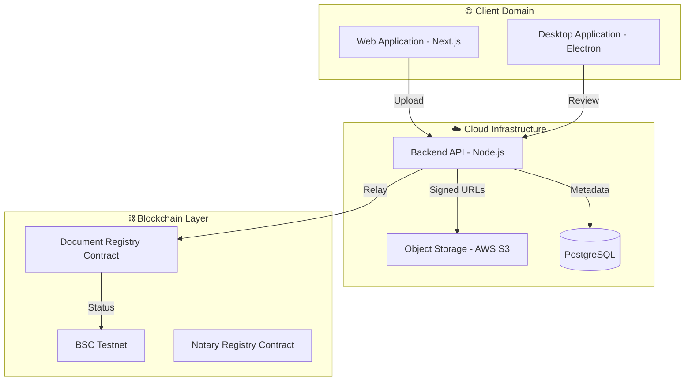
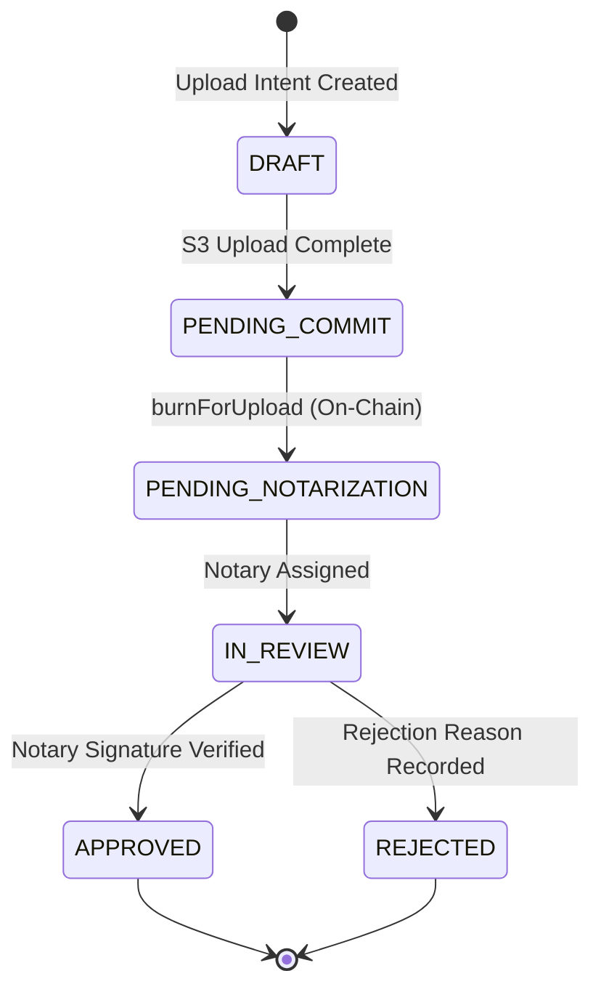
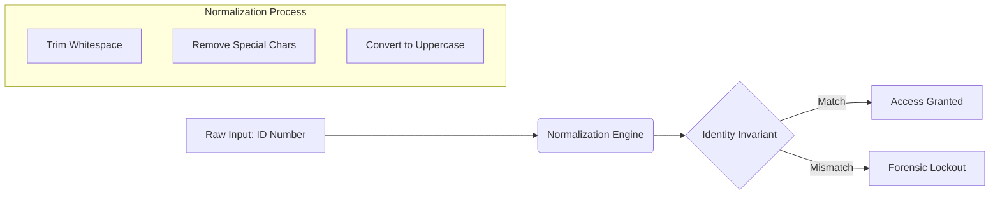
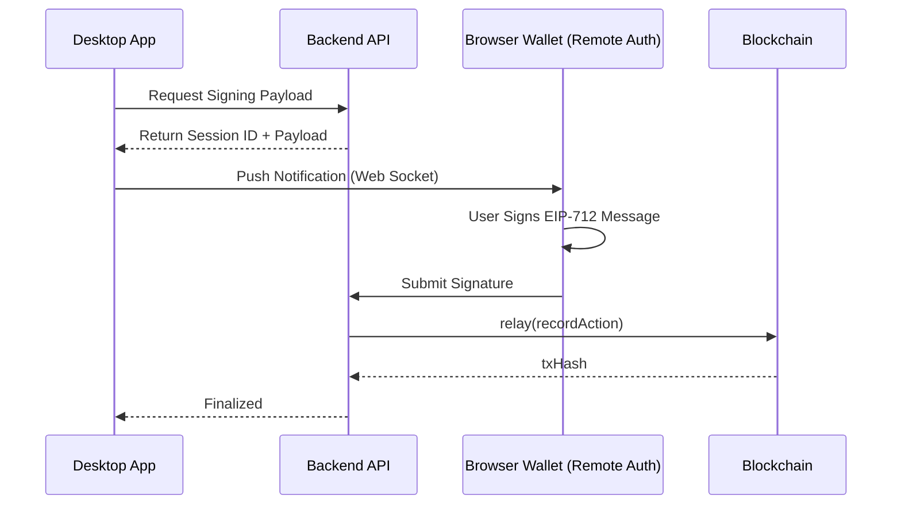
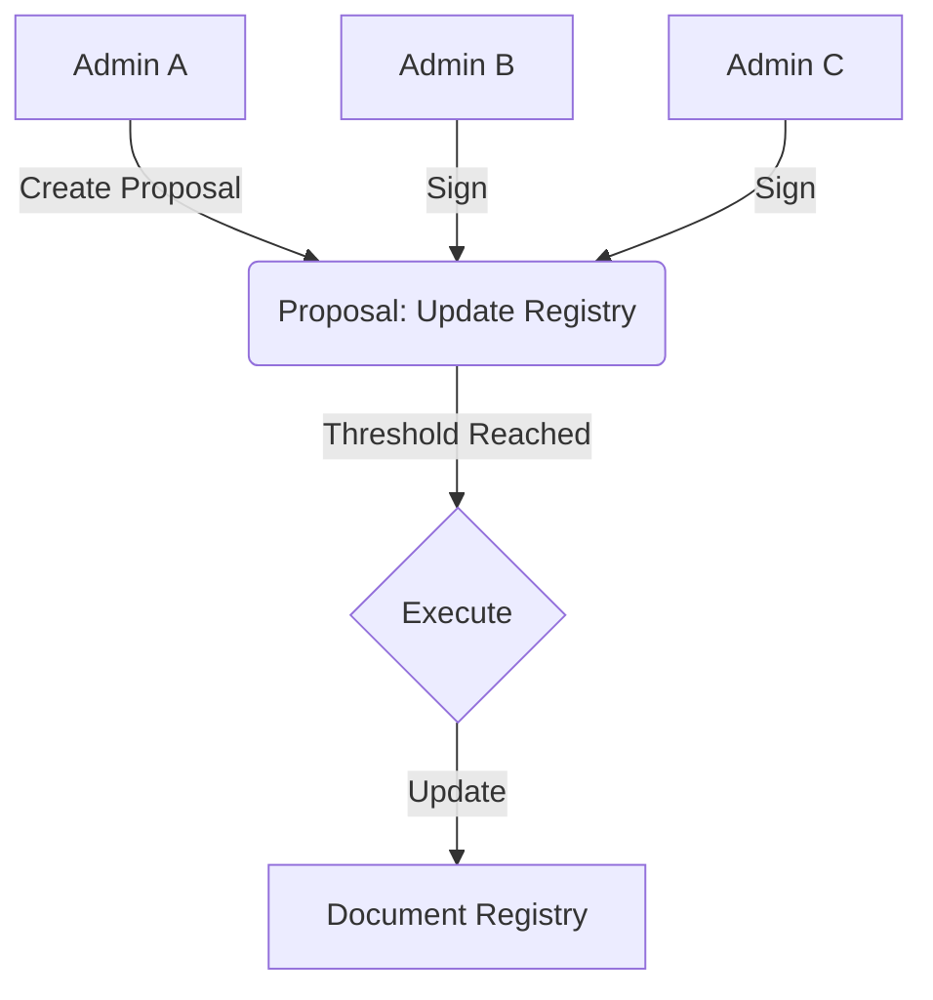

# 🛡️ BBSNS: The Global Secure Notarization Protocol

**BBSNS (Block-Chain Based Secure Notarization System)** is a decentralized infrastructure designed to provide absolute cryptographic certainty for document authenticity. By combining local desktop security with global blockchain finality, BBSNS eliminates the risk of document tampering and centralized identity fraud.

---

## 🏛️ 1. High-Level System Architecture

BBSNS operates across three distinct domains to ensure maximum security and scalability.

### **How it Works:**
- **Client Domain**: Users interact with the lightweight Web App for uploads, while Notaries use the Hardened Desktop App for high-security review.
- **Cloud Infrastructure**: The Backend acts as a stateless orchestrator, managing encrypted storage in S3 and state persistence in PostgreSQL.
- **Blockchain Layer**: The ultimate source of truth. It stores hashes (not files) to ensure privacy while providing immutable proof of existence.

---

## 📂 2. The Document Lifecycle (State Machine)

A document in BBSNS moves through a series of atomic states to prevent race conditions or unauthorized modification.

### **The Integrity Guarantee:**
1. **Commitment**: A user must "burn" NTK tokens on-chain before a document is even visible to the Notary pool. This prevents spam.
2. **Immutability**: Once a document hash is recorded in the `PENDING_NOTARIZATION` state, it can never be altered.
3. **Auditability**: Every transition is timestamped and signed by the responsible actor.

---

## 🔐 3. Forensic Identity & Security

BBSNS replaces traditional passwords with a **Zero-Trust Identity Invariant** system based on wallet signatures and National ID normalization.

### **Technical Deep-Dive:**
- **ID Normalization**: To prevent collision attacks (e.g., `ABC-123` vs `abc 123`), the system enforces a strict normalization pipeline (`trim` → `remove spaces` → `uppercase`).
- **Domain Separation**: The system enforces a "Hard Lock" between user types. A Document Owner can **never** access Notary-only endpoints, even if they compromise a session token.

---

## 🖋️ 4. EIP-712 Remote Signing Bridge

To keep private keys secure, BBSNS uses a specialized bridge that allows Notaries to sign documents in a secure browser wallet while reviewing them in the isolated Desktop App.

### **Why this matters:**
- **Security**: The private key never leaves the Notary's browser wallet (MetaMask).
- **Efficiency**: The Notary doesn't pay for gas. The system Relayer handles the transaction costs.
- **Compliance**: EIP-712 provides a human-readable summary of what is being signed.

---

## 🏛️ 5. Multi-Sig Governance Model

The protocol is not controlled by one person. Changes require a consensus from the administrative committee.

### **Governance Logic:**
- **Transparency**: Every proposal is visible to all admins.
- **Finality**: Once a threshold (e.g., 2-of-3) is met, the change is applied atomically to the smart contracts.

---

## 💎 6. Tokenomics (NTK & NTKR)

The system uses a dual-token model to align incentives between Users and Notaries.

| Token | Type | Purpose | How to Get |
| :--- | :--- | :--- | :--- |
| **NTK** | ERC-20 (Utility) | Used to pay for notarization and notary fees. | Purchased or earned by Notaries. |
| **NTKR** | ERC-20 (Reputation) | Non-transferable "Social Capital". | Granted after successful, high-quality notarizations. |

---

## 🛠️ 7. Resilience & Background Workers

BBSNS is "Self-Healing." It uses background workers to ensure the system remains responsive and consistent.

- **Scavenger Worker**: Scans S3 every 24h. If a document intent was created but never paid for, it purges the file to save storage costs.
- **Reconciliation Worker**: Compares the database with the blockchain. If a transaction was confirmed on-chain but the DB missed the event, it automatically heals the record.
- **Role Sync Worker**: Ensures that if a user's role is revoked on-chain, their access is immediately blocked in the API.

---

## 🚀 8. Getting Started

Detailed installation instructions for developers can be found in the [DEVELOPER_MASTER_GUIDE.md](./DEVELOPER_MASTER_GUIDE.md).

1. **Clone the Repository**.
2. **Setup your .env files** using the provided `.env.example` blueprints.
3. **Initialize the Database** using `final_schema.sql`.
4. **Deploy the Contracts** to BSC Testnet using Hardhat.

---

**BBSNS: Bridging Trust in the Digital Age.**
