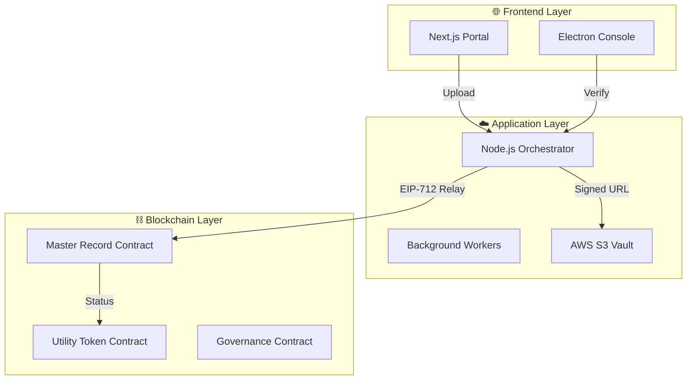
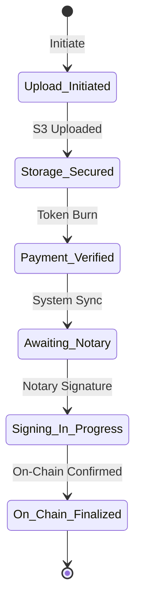
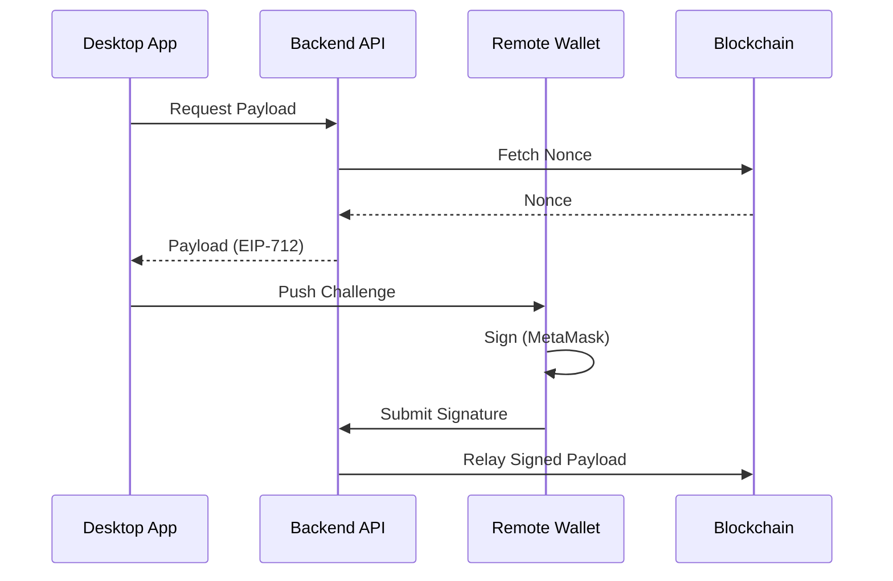
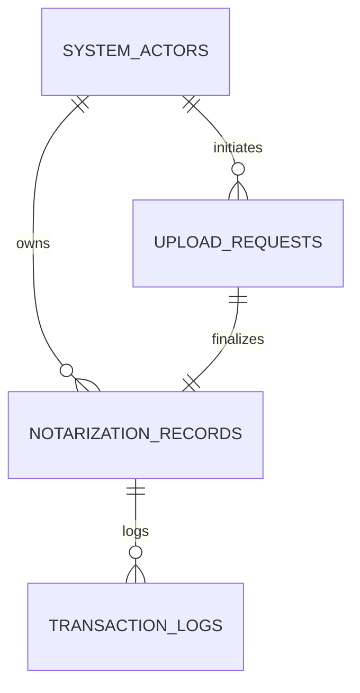

# 🛡️ BBSNS: Block-Chain Based Secure Notarization System


<div align="center">
  
</div>

> **A zero-trust platform bridging off-chain identity with on-chain finality to digitize the notary public system.**

**BBSNS** is an enterprise-grade decentralized infrastructure that securely modernizes remote notarizations. By combining biometric KYC, gasless EIP-712 remote signatures, AWS S3 storage vaults, and multi-signature smart contract governance, BBSNS provides irrefutable authenticity through cryptographic finality.

## ✨ Key Features
- **Zero-Trust Architecture:** End-to-end cryptographic verification for all actors.
- **Gasless Remote Signatures:** EIP-712 compliant off-chain signing relayed securely to the blockchain.
- **Immutable Document Vault:** Documents are sealed with SHA-256 and securely hosted on AWS S3.
- **Multi-Sig Governance:** A decentralized control plane for system parameters and role management.
- **Biometric Identity:** Deep integration with secure identity providers for Notary verification.

---

## 🏗️ 1. Global Ecosystem Blueprint
The relationship between Client applications, Cloud infrastructure, and the Blockchain source-of-truth.



---

## 📂 2. Document State Machine (Authoritative)
Tracking every document from initial intent to permanent on-chain finalization.



---

## 🖋️ 3. Cryptographic Bridge (EIP-712)
Step-by-step sequence of the gasless remote signing protocol.



---

## 🚀 4. System Requirements

### **API Server (Backend)**
- **OS**: Linux (Ubuntu 22.04 recommended) or Windows Server.
- **CPU**: 2+ Cores (optimized for bcrypt & crypto).
- **RAM**: 4GB Minimum (8GB recommended for concurrent worker threads).
- **Node.js**: v18.17.0 or higher.

### **Desktop Console (Notary)**
- **OS**: Windows 10/11 (64-bit).
- **RAM**: 4GB Minimum.
- **Dependency**: Microsoft Edge (for Remote Auth Bridge).

---

## 📊 5. Database Entity Architecture



---

## 🛡️ 6. Forensic Audit Log Schema
Every request through the core access control middleware generates a correlated audit trail in the following format:

```json
{
  "requestId": "UUID-V4",
  "actorId": "101",
  "role": "NOTARY",
  "capability": "DOC_SIGNATURE_PAYLOAD",
  "env": "VERIFIED",
  "chainId": "97",
  "timestamp": "2024-05-12T10:00:00Z"
}
```

---

## 🚀 7. Production Hardening Guide

1. **Process Management**: Use **PM2** with clustering.
   ```bash
   pm2 start [Core_Entry_Point] --name "Core-Service" -i max
   ```
2. **Reverse Proxy**: Setup **Nginx** with TLS 1.3 encryption.
3. **Database Security**: Enforce **SSL-only** connections to PostgreSQL.
4. **S3 Hygiene**: Enable **Object Lock** and **Versioning** on your production bucket.

---

**BBSNS: Authenticity through Cryptographic Finality.**
