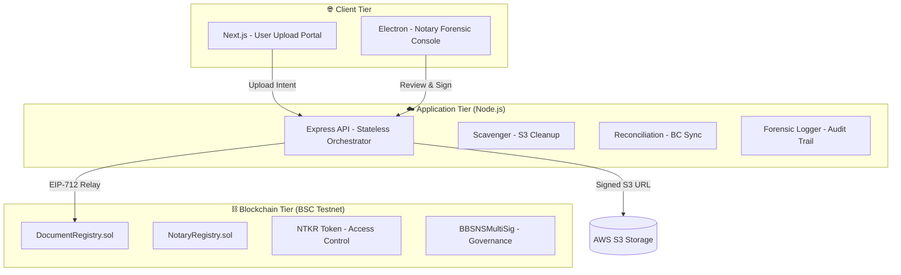

# 🛡️ BBSNS: The Global Secure Notarization Protocol

**BBSNS (Block-Chain Based Secure Notarization System)** is an enterprise-grade, decentralized infrastructure designed to provide absolute cryptographic certainty for document authenticity.

---

## 🏛️ 1. Infrastructure Deep-Dive

### **The Three-Tier Architecture**

---

## ⛓️ 2. Smart Contract Logic

### **A. The Document Registry (`DocumentRegistry.sol`)**
The heart of the protocol. It stores document existence proof via cryptographic hashes.
- **`recordAction(bytes32 docHash, ...)`**: The primary write function. It requires an **EIP-712 signature** from an authorized, non-banned Notary.
- **Integrity Check**: Enforces that `recoveredNotary != ownerAddress` to prevent self-notarization.
- **Gasless Model**: Uses a **Relayer Pattern** where the system pays gas fees for Notaries, ensuring zero-friction for officials.

### **B. Tokenomics & Access (`NTKR.sol`)**
- **Burn-to-Commit**: Users call `burnForUpload(uint256 amount, bytes32 intentId)` to pay for a notarization.
- **Intent Binding**: The `intentId` (UUID) is etched into the blockchain event, allowing the Backend to atomically link payments to specific files.
- **Daily Caps**: Enforces `dailySubmissionCount` to prevent DDoS attacks on the Notary pool.

---

## 🔐 3. Security & Forensic Audit

### **A. Identity Invariants (`actor.js`)**
The backend implements a **Multi-Layer Token Firewall**:
1. **Normalization**: Roles are standardized (`admin` → `3`, `notary` → `2`) to prevent bypass via string-case manipulation.
2. **Environment Recomputation**: Every high-risk request re-verifies the blockchain state (Chain ID, Block Staleness) to ensure the session hasn't "drifted" from reality.
3. **Identity State Lock**: Users are strictly gated by their `identity_state` (`ACTIVE`, `REJECTED`, `DEACTIVATED`).

### **B. National ID Forensic Bridge**
National IDs are processed through an authoritative normalization pipeline:
`trim()` → `replace(/\s+/g, '')` → `toUpperCase()` → `SHA-256 Hashing`.
This ensures that `ABC 123` and `abc-123` resolve to the same cryptographic identity, preventing double-identity fraud.

---

## 📂 4. Data Vault (AWS S3 & PostgreSQL)

- **Storage Strategy**: Files are stored in a hierarchical structure: `intents/{userId}/{intentId}/{fileId}`.
- **Immutability**: Once a document is moved to the `STORED` state, its `file_hash` is locked and used as the primary key for all future blockchain interactions.
- **Signed URL Lifecycle**: Pre-signed URLs for document review expire after **120 seconds** to minimize exposure risks.

---

## 🏛️ 5. Governance Architecture

Changes to the protocol require **Consensus Governance**:
- **BBSNSMultiSig**: A custom multi-signature wallet where a threshold (e.g., 2-of-3) of Admins must approve any registry update.
- **Notary Management**: Admins use the `NotaryRegistry` to promote users, revoke roles, or ban malicious actors across the entire network.

---

## 🚀 6. Operational Readiness

### **Background Workers**
| Worker | Responsibility | Frequency |
| :--- | :--- | :--- |
| **Scavenger** | Deletes S3 files for unpaid `upload_intents`. | Every 24h |
| **Reconciliation** | Fixes database states if blockchain transactions were confirmed. | Every 5 min |
| **Reputation** | Updates Notary `NTKR` balances based on action quality. | Continuous |

---

**BBSNS: Authenticity through Cryptographic Finality.**
