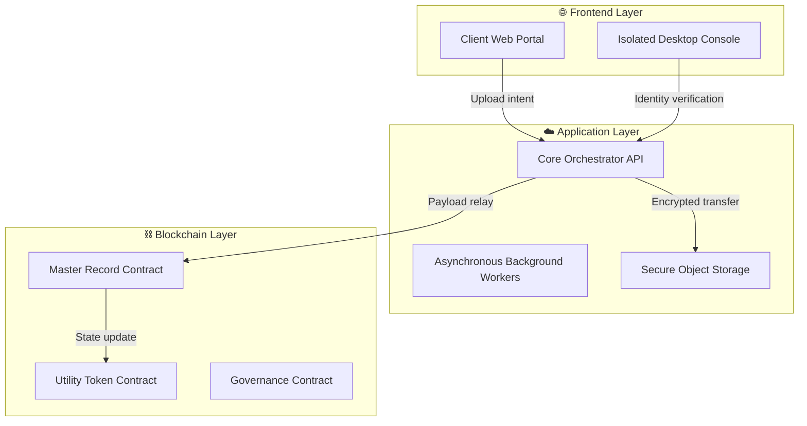
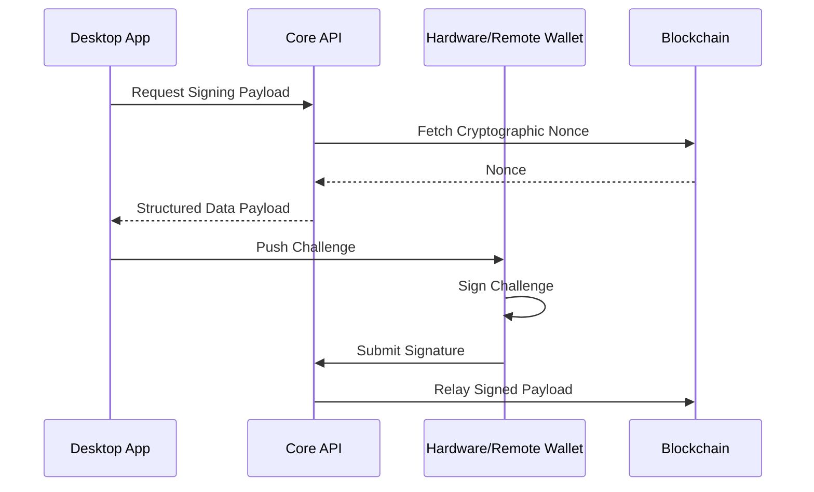
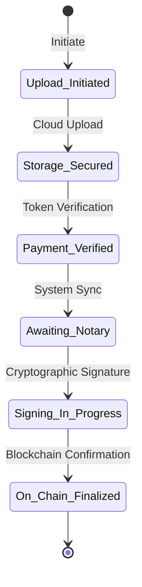
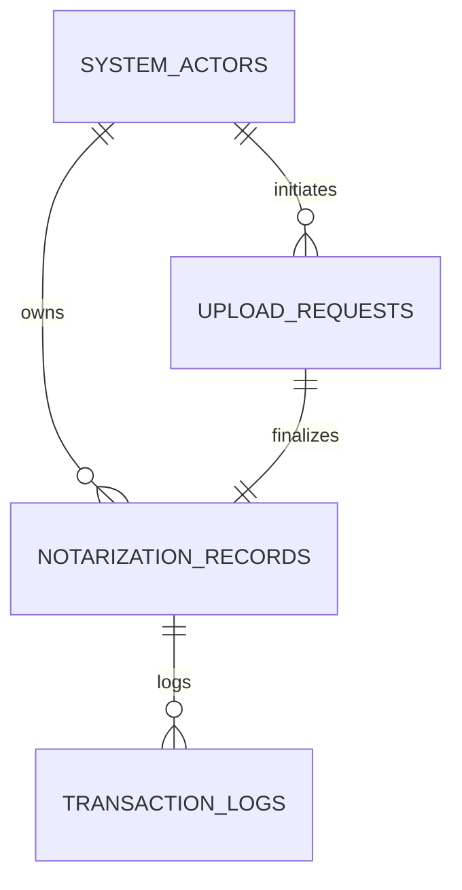

# 🛡️ BBSNS: Block-Chain Based Secure Notarization System


<div align="center">
  
</div>

> **A zero-trust platform bridging off-chain identity with on-chain finality to digitize the notary public system.**

**BBSNS** is a massive, enterprise-grade decentralized infrastructure that securely modernizes remote notarizations. It replaces legacy, paper-based trust assumptions with immutable cryptographic proof. By combining biometric identity verification, gasless off-chain remote signatures, secure cloud object storage, and multi-signature smart contract governance, BBSNS provides irrefutable authenticity through cryptographic finality on the blockchain.

---

## ✨ Core Pillars & Features

- **Zero-Trust Architecture:** End-to-end cryptographic verification for all actors. No action is trusted implicitly; every request is cryptographically signed and verified by core middleware.
- **Gasless Remote Signatures:** EIP-712 compliant off-chain signing allows non-technical users to interact with the blockchain securely, without needing to manage gas fees.
- **Immutable Document Vault:** Documents are sealed with SHA-256 hashing and securely hosted in highly restrictive cloud object storage.
- **Multi-Sig Governance:** A decentralized control plane for system parameters and role management, ensuring no single entity has absolute power over the system.
- **Automated Self-Healing:** Background worker processes continuously reconcile off-chain database states with on-chain realities, ensuring high availability and fault tolerance.

---

## 🏗️ 1. Global Ecosystem Blueprint

BBSNS operates across four deeply integrated layers, ensuring a seamless experience for end-users while maintaining strict security boundaries.



---

## 👥 2. Dual-Actor Workflows

BBSNS is designed around two distinct, highly specialized user journeys:

### **The Document Owner Flow (Client Web Portal)**
Clients utilize a seamless Next.js web interface to upload legal documents. The system hashes the document locally, creates a secure upload intent, and handles payment processing through a customized utility token economy. Clients can track the live notarization state machine from upload to final blockchain confirmation.

### **The Notary Flow (Isolated Desktop Application)**
Certified Notaries operate within a secure, sandboxed Electron desktop environment. To perform notarizations, they must pass strict biometric identity verifications. Once verified, they utilize a cryptographic bridge to review documents and apply their digital signature, which the system then relays to the blockchain.

---

## 🛡️ 3. Security & Cryptography Deep-Dive

Security is not an afterthought; it is the foundation of BBSNS.

*   **SHA-256 Document Sealing:** Documents are never stored on the blockchain. Instead, a SHA-256 cryptographic hash of the document is generated and sealed on-chain, proving the document existed at a specific time and has never been tampered with.
*   **ECDSA Signatures & EIP-712:** We engineered a custom bridge using Elliptic Curve Digital Signature Algorithm (ECDSA). Notaries sign standardized data payloads off-chain, and the backend relays these signatures to the blockchain.
*   **Strict Access Control Middleware:** Every API route is guarded by dynamic middleware that checks the actor's real-time authorization state before permitting data access.

### Cryptographic Signature Relay


---

## 🏛️ 4. Governance & Tokenomics

BBSNS operates its own internal micro-economy to align incentives and secure the network.

*   **Utility Token:** A dedicated smart contract token is used to meter system usage, pay for notarization services, and prevent spam.
*   **Decentralized Control Plane:** Critical system parameters (such as fee structures or upgrading notary statuses) are governed by a Multi-Signature smart contract. This ensures that administrative actions require consensus among trusted governance keys, preventing unilateral system modifications.

---

## 📂 5. Authoritative State Machine

The lifecycle of a document is strictly enforced by a state machine that spans both the relational database and the blockchain.



---

## 📊 6. Core Entity Architecture

The relational database acts as the high-speed caching and query layer for the blockchain source-of-truth.



---

## 🔍 7. Forensic Audit Log Schema

For enterprise compliance, every authenticated action generates an immutable audit log, tracking the exact capability exercised by an actor.

```json
{
  "requestId": "[Unique-Request-ID]",
  "actorRole": "[System-Role]",
  "capability": "[Action-Performed]",
  "environment": "[Security-Context]",
  "timestamp": "[ISO-8601-Time]"
}
```

---

## ⚙️ 8. Technology Stack Overview

| Layer | Technology | Purpose |
| :--- | :--- | :--- |
| **Web Client** | Next.js / React | Fast, server-side rendered portals for Document Owners. |
| **Desktop Client** | Electron | Secure, isolated environment bridging hardware wallets. |
| **Core API** | Node.js / Express | Highly concurrent, asynchronous orchestration layer. |
| **Smart Contracts** | Solidity / Hardhat | The immutable, decentralized source of truth. |
| **Data Layer** | PostgreSQL | Fast, relational querying and state caching. |
| **Blob Storage** | AWS S3 | Immutable, highly restricted document vaulting. |

---

## 🚀 9. Production Resiliency

BBSNS is built to survive network partitions and high loads:
1. **Automated Background Workers:** Independent asynchronous processes continuously scan for dropped transactions or blockchain sync issues, automatically self-healing the state machine.
2. **Clustered Processing:** The core API is designed to run in clustered environments (e.g., PM2) to maximize multi-core CPU utilization during heavy cryptographic operations.
3. **Database Security:** Enforced SSL-only connections and strict sanitization.
4. **Storage Hygiene:** Leveraging cloud features like Object Lock and Versioning to prevent accidental or malicious document deletion.

---

<div align="center">
  <b>BBSNS: Authenticity through Cryptographic Finality.</b>
</div>
