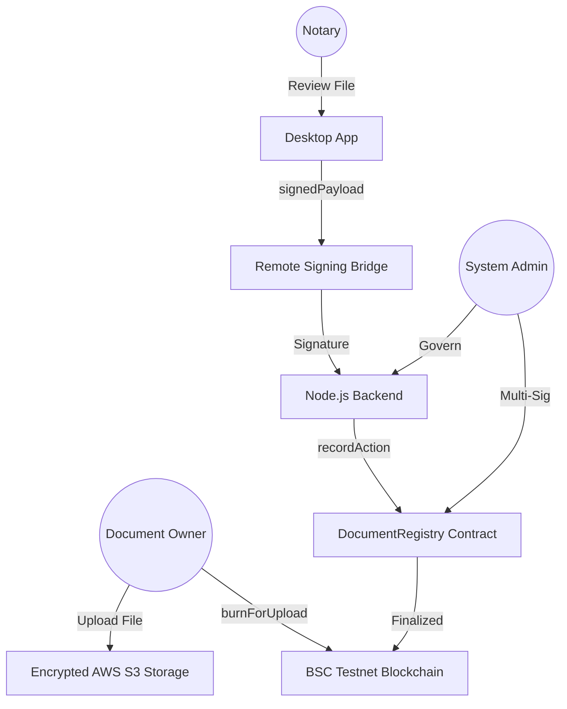

# 🛡️ BBSNS: Block-Chain Based Secure Notarization System

**BBSNS** is a production-grade, decentralized notarization protocol designed to bridge the gap between secure local document management and permanent on-chain verification.

[](https://opensource.org/licenses/MIT)


---

## 🏗️ System Architecture

The BBSNS ecosystem is built on a **Three-Tier Secure Architecture**:



---

## ✨ Key Features

*   **🔒 Zero-Trust Identity**: Mandatory verification of actor context for every database mutation.
*   **🖋️ EIP-712 Signing**: Secure, off-chain document signing with on-chain relay (Gasless for Notaries).
*   **📂 Forensic Auditing**: Real-time logging of all security events with correlation IDs.
*   **⚖️ Decentralized Governance**: Multi-sig proposal system for protocol updates.
*   **🚀 Automated Reconciliation**: Background workers to fix state discrepancies between DB and Blockchain.

---

## 🛠️ Tech Stack

*   **Backend**: Node.js, Express, PostgreSQL, AWS S3/KMS.
*   **Frontend**: 
    *   **Desktop**: Electron, Vite, React, TypeScript.
    *   **Web**: Next.js, Tailwind CSS, Shadcn UI.
*   **Blockchain**: Solidity (0.8.20), Hardhat, Ethers.js.

---

## 📂 Directory Structure

```text
BBSNS_Deliverables/
├── web_deliverable/                 # Next.js Web Application
├── desktop_deliverable/             # Electron Desktop Application
└── backend_and_blockchain_deliverable/
    ├── backend/                     # Node.js API Server
    ├── contracts/                   # Solidity Smart Contracts
    └── database/                    # SQL Schema & Migrations
```

---

## 🚀 Quick Start (Production)

### **1. Backend & Database**
```bash
cd backend_and_blockchain_deliverable/backend
npm install
psql -d [DB_NAME] -f ../database/final_schema.sql
npm start
```

### **2. Desktop Console**
```bash
cd desktop_deliverable
npm install
npm run dev
```

### **3. Smart Contracts**
```bash
cd backend_and_blockchain_deliverable/contracts
npx hardhat compile
npx hardhat run scripts/deploy.js --network bnbTestnet
```

---

## 🛡️ Security Forensics

BBSNS implements a **Hardened Identity Invariant** system:
- **Identity State Lock**: Users with `identity_state = ACTIVE` are guaranteed system access regardless of sync lag.
- **Atomic State Machine**: Document transitions follow a strict `Pending` → `Review` → `Approved/Rejected` path, enforced by the `DocumentStatusService`.

---

## 📜 License

Distributed under the MIT License. See `LICENSE` for more information.

---

**Built with ❤️ by the BBSNS Core Team.**
