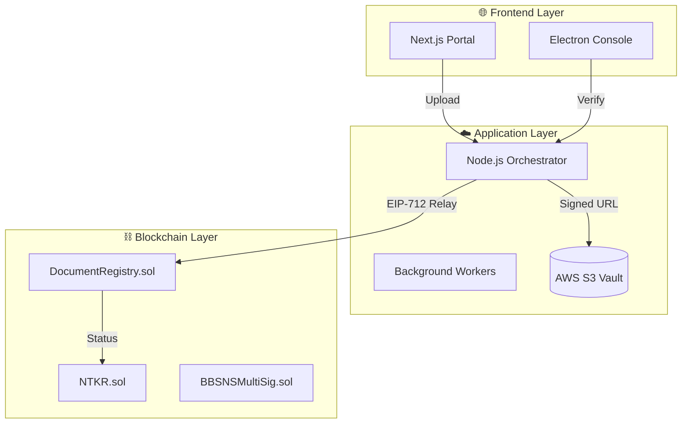
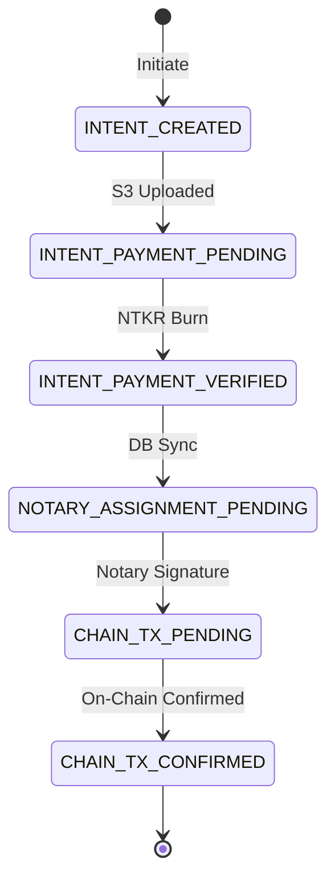
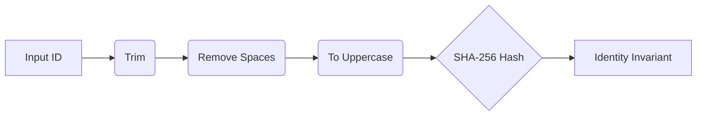
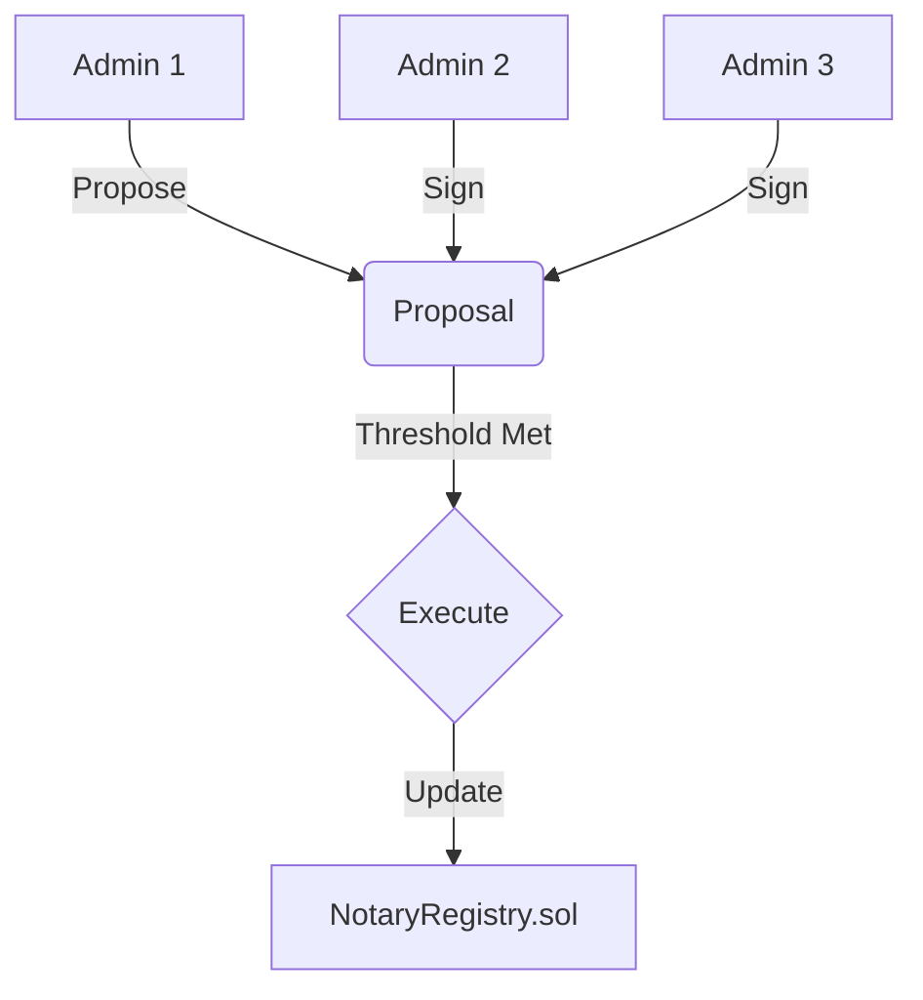
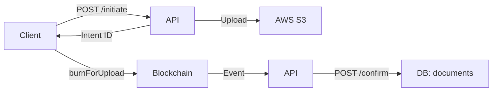
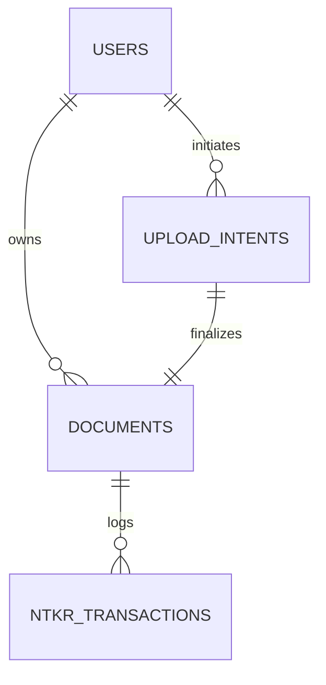
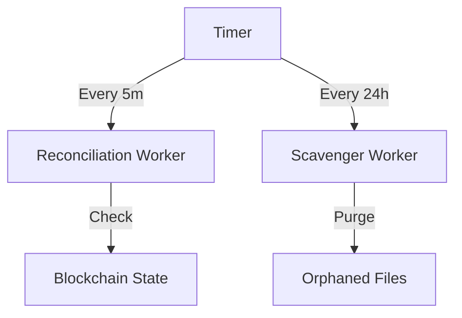
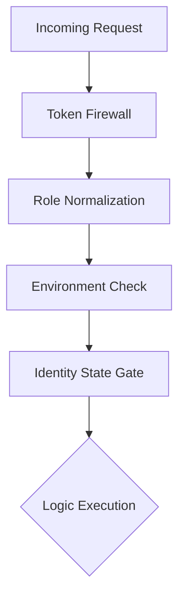
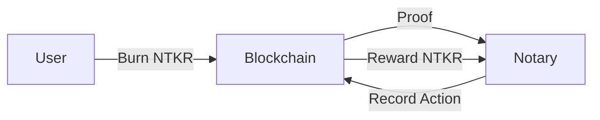

# 🛡️ BBSNS: The Visual Technical Encyclopedia

**BBSNS (Block-Chain Based Secure Notarization System)** is an enterprise-grade decentralized infrastructure. This document provides a granular technical map of the protocol's engineering, security, and cryptographic foundations.

---

## 🏗️ 1. Global Ecosystem Blueprint
The relationship between Client applications, Cloud infrastructure, and the Blockchain source-of-truth.



---

## 📂 2. Document State Machine (Authoritative)
Tracking every document from initial intent to permanent on-chain finalization.



---

## 🔐 3. Forensic Identity Invariants
The normalization engine that prevents identity fraud and collision attacks.



---

## 🖋️ 4. Cryptographic Bridge (EIP-712)
Step-by-step sequence of the gasless remote signing protocol.


---

## 🏛️ 5. Multi-Sig Governance Chain
How the administrative committee manages protocol updates and roles.



---

## 💸 6. The Upload-Payment Atomic Loop
The precise sequence ensuring files are paid for before becoming visible.



---

## 📊 7. Database Entity Architecture
The relational map connecting Users, Documents, and Blockchain Intents.



---

## 🚀 8. Self-Healing Worker Lifecycle
The timing and triggers for the system's background resilience workers.



---

## 🛡️ 9. Request Execution Trace
The multi-layer protection applied to every API request via `actor.js`.



---

## 💎 10. The Tokenomics Flywheel
Incentive alignment between Document Owners (Users) and Officials (Notaries).



---

## ☁️ 11. Secure Storage Hierarchy
Logical partitioning of the Encrypted S3 Vault for maximum isolation.

```mermaid
graph TD
    Root[/BBSNS-Bucket/] --> Intents[/intents/]
    Intents --> UserID[/{userId}/]
    UserID --> IntentID[/{intentId}/]
    IntentID --> FileID[/{fileId}.pdf]
```

---

## 🛑 12. Circuit Breaker Protocol
The system response to an emergency on-chain `pause()` command.


---

## 📖 13. Deep Technical Documentation

### **Cryptographic Primitives**
- **Hashing**: SHA-256 for files, Keccak-256 for on-chain proof.
- **Signing**: EIP-712 (Typed Data) and EIP-191 (Personal Sign).
- **Communication**: TLS 1.3 (API) and WSS (Remote Auth).

### **Production Deployment Strategy**
1. **API**: Managed via PM2 with `max_memory_restart: 1G`.
2. **Database**: PostgreSQL with row-level security and `context-rebinder` audit trails.
3. **Storage**: AWS S3 with **Versioning** enabled to prevent accidental deletion.

---

**BBSNS: Authenticity through Cryptographic Finality.**
